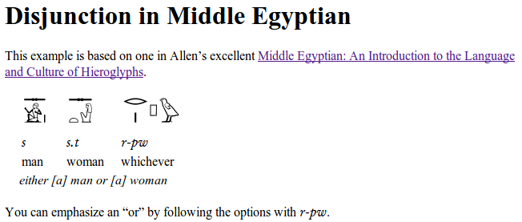

# Hierogloss

**WORK IN PROGRESS. Future releases may change how things work.**

Hierogloss is a set of extensions for the [Kramdown][] gem for people
working with hieroglyphs.  Hierogloss allows you to mix glossed
hieroglyphic texts with Markdown-style formatting.  For example, you can
write:

    # Disjunction in Middle Egyptian

    This example is based on one in Allen's excellent [Middle Egyptian: An
    Introduction to the Language and Culture of Hieroglyphs][allen].

    H: 𓊃𓀀𓏤 | 𓊃𓏏𓁐 | 𓂋𓏤𓊪𓅱
    L: s | s.t | r-pw
    G: man | woman | whichever
    T: either [a] man or [a] woman

    You can emphasize an "or" by following the options with {r-pw}.

    [allen]: http://www.amazon.com/Middle-Egyptian-Introduction-Language-Hieroglyphs/dp/0521741440

Note that the inline transliteration is marked with \{ and \}, and that all
transliterations are given in MdC format.  This allows transliterations to
be presented in an appropriate font with Unicode characters.

You can render this as HTML by running:

    hierogloss example.md > example.html

This will give you the following:

> 

If you wish to post your text on an online forum, you may have luck with
`bbcode` mode:

    hierogloss -f bbcode example.md > example.bbcode

Note that `bbcode` does not support all the features of Markdown, although
I'm happy to implement more of them--or to accept patches!

## Installation

To install Hierogloss, make sure you have a working Ruby 2.0 setup, and
then run the following:

    $ gem install hierogloss

## Using Hierogloss from a program

Add this line to your application's Gemfile:

    gem 'hierogloss'

And then execute:

    $ bundle

To convert Hierogloss-format text to HTML, use the regular Kramdown APIs,
but pass `input: 'hierogloss'` as an argument:

    require 'kramdown'
    require 'hierogloss'
    Kramdown::Document.new(text, input: 'hierogloss').to_html

## Contributing

1. Fork it
2. Create your feature branch (`git checkout -b my-new-feature`)
3. Commit your changes (`git commit -am 'Add some feature'`)
4. Push to the branch (`git push origin my-new-feature`)
5. Create new Pull Request

[kramdown]: http://kramdown.gettalong.org/
